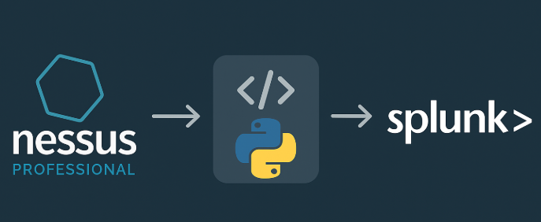

# Nessus Splunk Checkpoint



---

## 📌 Descripción

**Nessus Splunk Checkpoint** es un script en Python que permite enviar los resultados de escaneos de vulnerabilidades desde **Nessus Professional** hacia **Splunk**, utilizando HEC (HTTP Event Collector).  
El script evita duplicaciones usando un archivo de checkpoint local (`checkpoint.json`) que registra qué plugins ya fueron enviados por host y por escaneo.

---

## ⚙️ Pre-requisitos

- Python 3.8 o superior.
- Token HEC de Splunk habilitado.
- Llaves de acceso (Access Key y Secret Key) del API de Nessus Professional.
- Conexión de red entre tu servidor y los servicios de Splunk y Nessus.

> Las variables `HEC_TOKEN`, `N_ACCESS_KEY` y `N_SECRET_KEY` pueden definirse mediante:
> - Variables de entorno (recomendado para mayor seguridad), o  
> - El archivo `servers.json` incluido como plantilla en el repositorio.

---

## ▶️ Cómo usarlo

1. Clona el repositorio:
```bash
git clone https://github.com/Bl4ck0xday/nessus_splunk_checkpoint.git
cd nessus_splunk_checkpoint
```

2. Instala las dependencias:
```bash
pip install -r requirements.txt
```

3. Configura tus credenciales

Edita el archivo `servers.json` e incluye todas las siguientes variables:

- En la sección **Splunk**:
  - `Address`: IP o DNS del servidor Splunk.
  - `Port`: Puerto del HEC (por defecto 8088).
  - `Protocol`: `http` o `https`.
  - `HEC_TOKEN`: Token del HTTP Event Collector.
  - `Sourcetype`: Sourcetype para los eventos, por ejemplo `nessus:json`.
  - `Host`: Nombre o etiqueta que identificará los eventos en Splunk.

- En la sección **Nessus**:
  - `Address`: IP o DNS del servidor Nessus.
  - `Port`: Puerto del API de Nessus (por defecto 8834).
  - `Protocol`: `http` o `https`.
  - `AccessKey`: Access Key generada en la interfaz de Nessus.
  - `SecretKey`: Secret Key correspondiente.

> 💡 Este archivo es **obligatorio** para el funcionamiento del script. Asegúrate de completarlo correctamente antes de ejecutar.

4. Ejecuta el script:
```bash
python3 nessus_splunk_checkpoint.py
```

---

## 💡 Recomendaciones

- Asegúrate de tener escaneos configurados en Nessus con una periodicidad adecuada a tus necesidades (por ejemplo, diarios o semanales).
- Puedes usar `cron` (Linux) o el Programador de Tareas (Windows) para automatizar la ejecución del script y enviar vulnerabilidades recién detectadas a Splunk de manera continua.

---

## 👤 Autor

**Francis Segura**  
[LinkedIn](https://www.linkedin.com/in/francis-segura-22a0191a8/)

---

## 📄 Licencia

Este proyecto está bajo la licencia MIT. Ver el archivo [LICENSE](LICENSE) para más detalles.